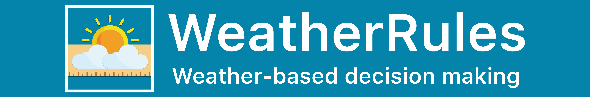

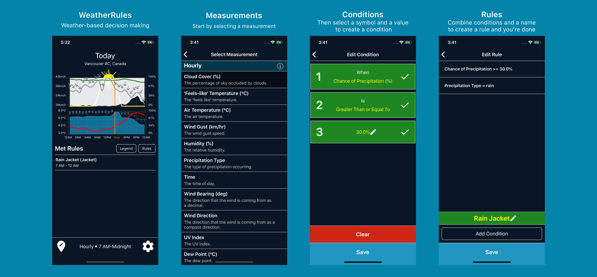

This repo contains the entire WeatherRules iOS app, that was available on the iOS App Store until Apple shutdown the Dark Sky API and replaced it with WeatherKit.

This repo is meant as a portfolio piece and an example of my code, you won't be able to just build and run it as it's missing API Keys among other things.

## Screenshots

iPhone X Screenshots

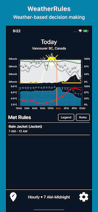
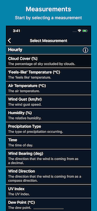
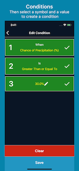
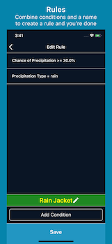
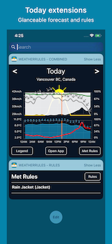
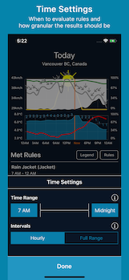
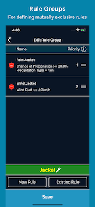
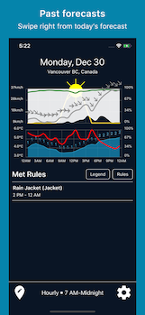
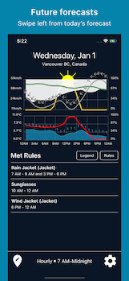
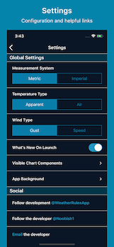

iPhone 8 Plus Screenshots

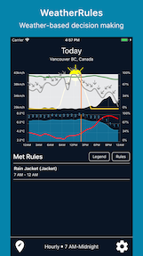
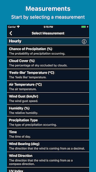
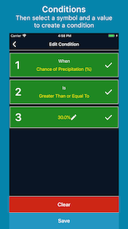
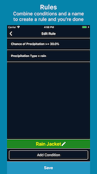
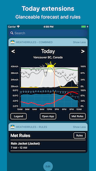
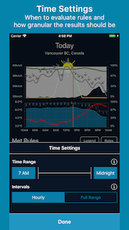
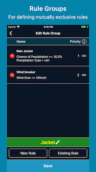
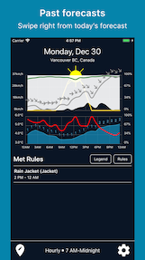
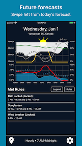
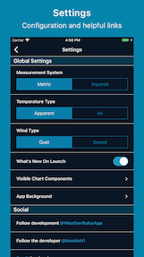

iPad Screenshots

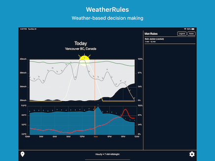
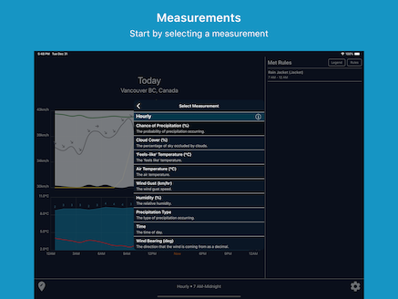
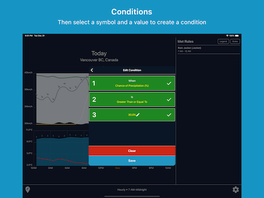
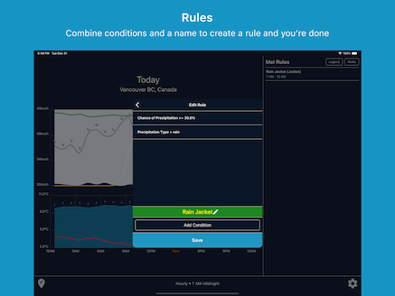
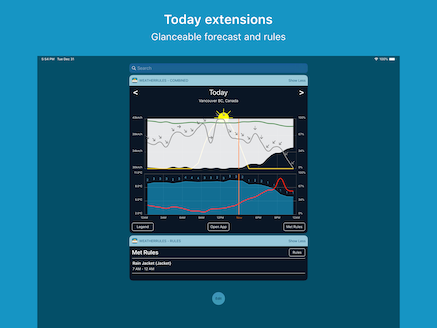
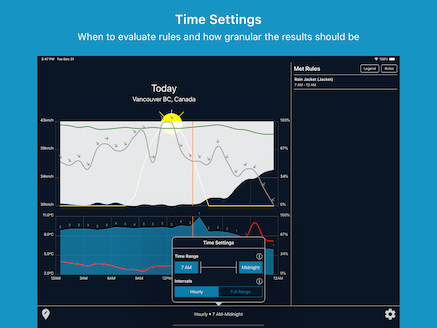
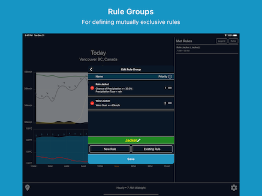
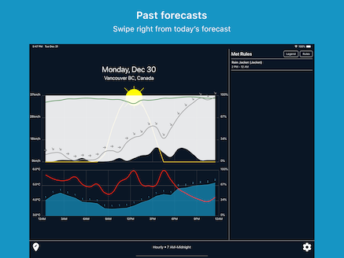
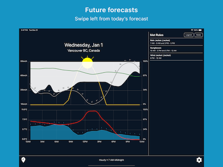
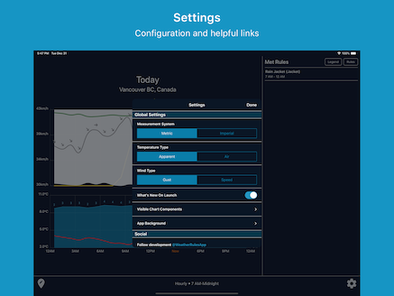

## Organisation

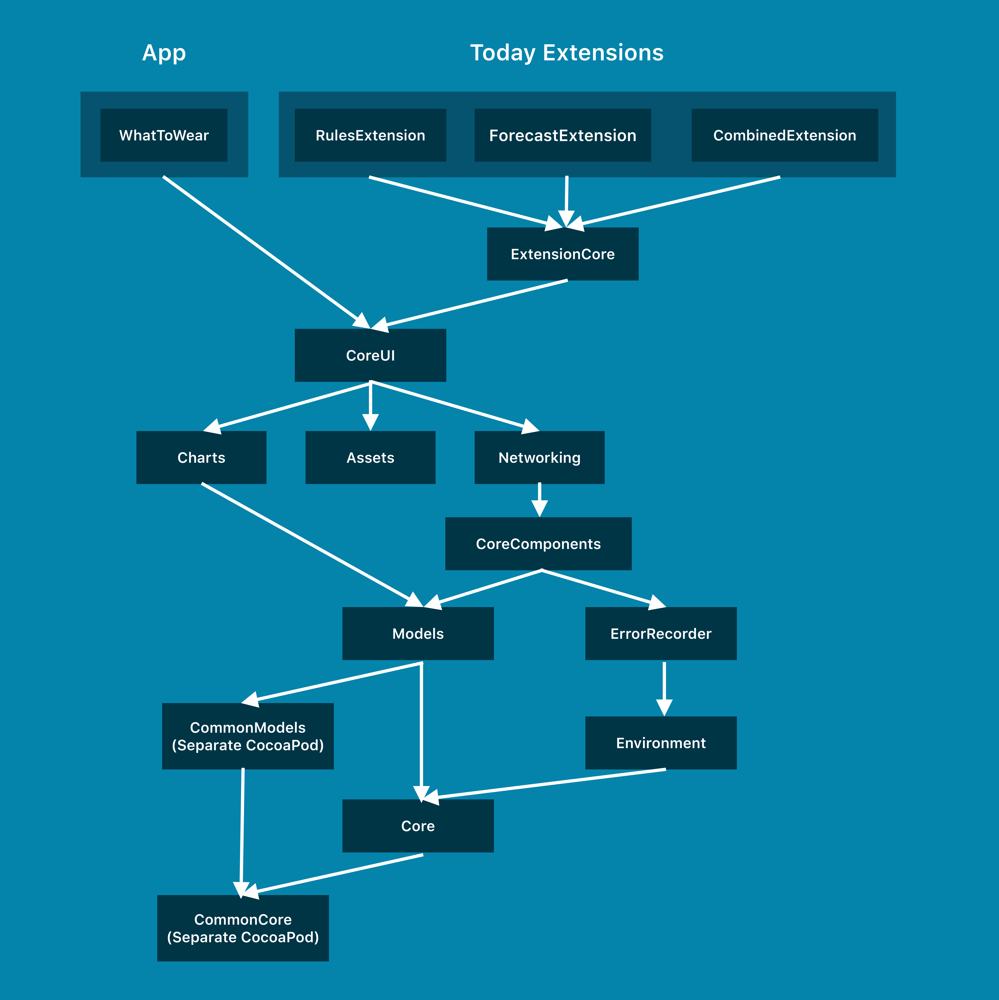

The app is split into a number of frameworks/targets

* `WhatToWear`: Main App Target
* `RulesExtension`: Rules Today Extension
* `ForecastExtension`: Forecast Today Extension
* `ExtensionCore`: Code that is shared between the Today Extensions
* `CoreUI`: Reuseable UI components
* `Assets`: Images used throughout the app
* `Charts`: Components used for making charts/graphs
* `Networking`: Networking components for making API calls primarily
* `CoreComponents`: Common objects used in multiple places that don't fit elsewhere
* `Models`: Model objects, whether they be from the DarkSky API or elsewhere
* `CommonModels`: Shared Models between this app and an in progress Swift Backend component, repo is [here](https://github.com/Noobish1/WhatToWearCommonModels)
* `Core`: Mostly Extensions of Apple frameworks that are used everywhere
* `CommonCore`: Shared Extensions of Apple frameworks between this app and an in progress Swift Backend component, repo is [here](https://github.com/Noobish1/WhatToWearCommonCore)
* `ErrorRecorder`: Wrapper for sending non-fatal errors to AppCenter (as custom events) as well as Analytics
* `Environment`: Splitting Dev/Prod environments

## Other Highlights

### Unit tests

There is a small-ish test suite of ~300 tests using the [Quick](https://github.com/Quick/Quick) and [Nimble](https://github.com/Quick/Nimble) BDD frameworks.

* [CoreTests](App/Core/WhatToWearCoreTests)
* [ModelsTests](App/Models/WhatToWearModelsTests)
* [CoreComponentsTests](App/CoreComponents/WhatToWearCoreComponentsTests)

Tests in other repos

* [CommonCoreTests](https://github.com/Noobish1/WhatToWearCommonCore/tree/master/WhatToWearCommonCoreTests)
* [CommonModelsTests](https://github.com/Noobish1/WhatToWearCommonCore/tree/master/WhatToWearCommonCoreTests)

### Assets

All images (except App Icons and Launch images) are in the `Assets` framework and I use [R.swift](https://github.com/mac-cain13/R.swift) for compile-time checking of them.

### Linting

I use [SwiftLint](https://github.com/realm/SwiftLint) to lint this project, the config file can be found [here](App/.swiftlint.yml).

## Usage

If you really want to build and run it you'll need to sort out:

* DarkSky API Keys
* AppCenter API Keys
* Code-signing settings

